# Question bank sections and mobile question linking: design handoff

> **Integration update, later 2026-09-24:** This remains Nikko's design
> proposal and its branch snapshots below are historical. Nikko owns mobile
> selection/sending of the paper's `question_id`, which is Program 1's
> question. Jayrald owns the cloud schema and migration work needed for the
> complete flow (`answers`, `gate_result`, validated-question fields and
> question sections). Pushed `feature/pre-extraction` includes the pushed
> `feature/program-tabs` work and can be tested on new papers independently
> of the complete mobile/question-bank integration. See
> [TEAM_SYNC.md](../TEAM_SYNC.md) and [docs/README.md](../README.md) for
> current status before acting on the older branch descriptions below.

**For:** Nikko (question bank + mobile)
**From:** Nombrado (review editor / program tabs)
**Date:** 2026-09-24
**Status:** Proposal. You own the design and the final decisions. This doc explains what's needed and why, and shows one way to do it.

---

## 1. Why this is needed

The web review now has **program tabs**, on branch `feature/program-tabs`: one student paper can hold several programs, and the teacher links each program to a question from the question bank. Grading then checks each program against **that question's** model answer and test cases.

For that to work, the teacher has to be able to find the right question quickly and tell questions apart. Today they can't:

1. **Questions have no section and no number.** The only identifier is the free-text **Question Name**, whose placeholder is "e.g. Skill Test 1A". Two questions can have the same name, and the "2." a student writes on paper matches nothing in the app.
2. **Submission folders are typed by hand.** In the review's Details step, the teacher types a "Topic or folder", e.g. "Loops or Chapter 3". The same topic can end up as `Loops`, `loops` and `Chapter 3`, and it isn't connected to the question.
3. **The mobile app doesn't link papers to questions.**
   - `main` branch: `main.dart` passes a hard-coded placeholder `questionId: '3f4b3b6e-1234-4567-8910-abcdef123456'`.
   - Your `feature/document-scanner` branch: the batch upload inserts only `image_url` and `status`.
   - Either way, every paper arrives unlinked, and the teacher has to link each one by hand in Details.
4. **The question form saves unvalidated model answers.** `save()` in `question-form.ts` checks only that the name, text and model answer are filled in. It never checks `canPublish`, even though the form computes it. This was the #1 open item in the 2026-09-02 status audit. A broken model answer means wrong grades.

The goal: **every question has a section and a number, papers are linked to a question when they're captured, and submissions are filed by the same sections.** A person makes every choice. Nothing is guessed by OCR.

---

## 2. What already exists (build on it, don't redo it)

| What | Where | State |
|---|---|---|
| Create Question form | `maistra_web/src/app/components/question-form/` | On main. Fields: `question_name`, `question_type` (`function`/`program`), `question_text`, `model_answer`, `test_cases[]` with `test_code`, `test_input`, `expected_output`, `mark`. **Validate Test Cases** runs Judge0. The form clears after saving. |
| **Your question bank page** | branch `feature/question-bank` (`50fc362`, 2026-09-06), `components/question-bank/` | **Not merged.** Lists all questions with expandable model answer and test cases, plus a slide-in drawer navbar. Its number is the list index (`i + 1`), not a stored number. |
| **Your batch capture** | branch `feature/document-scanner` (`2e65eff`, 2026-09-07), `batch_review_screen.dart`, `batch_queue.dart` | **Not merged.** Capture several papers, review, then upload. The upload sets no `question_id`. |
| Submission folders | `submissions-list.ts` (`groupedSubmissions`), from `submissions.topic` | Typed in Details; empty ones go to "Uncategorized". |
| Jayrald's assessments | branch `code-similarity/duplicate` (2026-09-05), migration `20260905010000_add_assessment_roster_similarity_schema.sql` | **Not merged.** Adds `assessments` (name, status draft/active/closed), `assessment_questions (assessment_id, question_id, position, starter_code)`, `students`, `block_sections`, `assessment_roster`, and `submissions.assessment_id / student_id / block_section_id`. It requires a submission's question to belong to its assessment. |
| Program tabs | branch `feature/program-tabs` (Nombrado) | Pushed, not merged. Programs 2+ are stored in `submissions.answers` as `[{ code, question_id }]`. Program 1 is still `verified_text` + `question_id`. |

**Talk to Jayrald before adding columns.** He owns the Supabase schema, and his `assessments` / `assessment_questions.position` may already cover grouping and numbering. See section 6.

---

## 3. The whole flow

```mermaid
flowchart LR
  A[Teacher creates question<br/>section + number + validated model answer] --> B[Question bank<br/>grouped by section]
  B --> C[Mobile: choose<br/>'Capturing for: Basic · Q2']
  C --> D[Take photos<br/>quality gate unchanged]
  D --> E[Upload with question_id]
  E --> F[Web submissions<br/>folder = question's section]
  F --> G[Review: Details<br/>question already set, confirm or change]
  G --> H[Review code: program tabs<br/>link extra programs]
  H --> I[Grading<br/>per program, per question]
```



- **Nikko:** A, B, C, D, E, F, plus the section shown in G.
- **Nombrado:** H, plus showing the new labels in the tab picker.
- **Jayrald:** the schema and I.

---

## 4. Part A: Question bank (web)

### A1. Sections and numbers

- Every question belongs to **one section**, e.g. `Basic`, `Conditionals`, `Loops`, `Arrays`, `Functions`. Teachers can add sections, and the list shouldn't be hard-coded.
- Every question has a **number inside its section**: Basic Q1, Basic Q2, Conditionals Q1…
- The number is **stored**, not taken from the list order, so deleting or reordering questions doesn't renumber them silently.
- A number can't repeat inside a section. The form refuses a duplicate with a clear message.
- **One label format everywhere**, in the bank, the review picker, the mobile picker and the submission cards:

  ```
  Basic · Q2 · Sum of two numbers
  ```

  The **Question Name** becomes just the short title ("Sum of two numbers"). Section and number are separate fields.

- **Sections vs Jayrald's assessments.** They answer different questions:
  - **Section:** what the question covers (Basic, Loops).
  - **Assessment:** which quiz or test it's in (Skill Test 1).

  Options to decide with Jayrald:
  - **(a) Sections only for now.** Simplest, and it matches the mocks.
  - **(b) Both.** A question has a section, and `assessment_questions.position` numbers it inside an assessment. The label could then be `ST1 · Q2 · Sum of two numbers`, with the section shown as a tag.
  - **(c) Use assessments as the sections.** Only if the class really organizes everything by quiz.

### A2. Question bank list screen

Extend your `feature/question-bank` page:

```
Question bank                                        [+ Create question]
[ All sections ▾ ] [ Search questions…               ]

▾ Basic                                                   2 questions
  Q1  Hello, name            Program · 2 tests · Validated     4 papers
  Q2  Sum of two numbers     Program · 3 tests · Validated    12 papers
▾ Conditionals                                            2 questions
  Q1  Even or odd            Program · 4 tests · Validated     9 papers
  Q2  Largest of three       Program · 2 tests · Not validated 0 papers
▸ Loops                                                   1 question
▾ No section yet                                          1 question
  —   sum of two integers    Program · 1 test  · Not validated 3 papers
```

- Sections collapse and expand. Inside each, questions are sorted by number.
- Each row shows the number, name, type, test-case count, **Validated / Not validated**, and **how many papers are linked**.
- **"No section yet"** holds the old questions that already exist, so teachers can give them a section and number. Nothing is lost.
- Filter by section, and search by name or text.
- Clicking a row opens the question page (A3).

### A3. Question page

```
← Question bank
Basic · Q2 · Sum of two numbers                        [Edit] [Validate test cases]
Program · 3 test cases · 5 marks · Used by 12 papers
Read two integers and print their sum.

Model answer                     Test cases
┌──────────────────────────┐     #  Input    Expected  Mark
│ #include <stdio.h> ...   │     1  2 3      5         2
└──────────────────────────┘     2  -1 1     0         2
                                 3  10 5     15        1

Papers linked to this question                                        12
[photo card] [photo card] [photo card] …
```

- Read-only by default, with **Edit** to change it.
- **Papers linked to this question** shows the same photo cards as the submissions list. A paper counts as linked when:
  - its `question_id` is this question (Program 1), **or**
  - one of its `answers` entries has this `question_id` (Program 2+ from the program tabs). Show "Program 2 on this paper" on those cards.
- If the model answer hasn't passed validation, show a warning at the top.

### A4. Create / Edit form

This is today's form with these changes:

| Field | Change |
|---|---|
| **Section** *(new, required)* | Dropdown of existing sections, plus "+ New section". |
| **Question No.** *(new, required)* | A number of 1 or more. Show the numbers already used in that section, e.g. "Taken in Basic: Q1, Q2". Refuse duplicates. |
| Question Name | Stays, but becomes the short title. New placeholder: "e.g. Sum of two numbers". |
| Label preview *(new)* | Live text under the name: "Teachers will see: **Basic · Q3 · Count vowels**". |
| Type, Text, Model Answer, Test Cases | Unchanged. |
| **Save Question** | **Only works after validation passes** (`canPublish`). Changing the model answer or a test case clears it again, as the form already does. |

- The same form edits existing questions: open it pre-filled from A3.
- **Editing a question that already has graded papers** changes what those papers are graded against. Decide with Jayrald: lock graded questions, keep versions, or warn with "Used by N papers. Editing changes their grading."

### A5. Submission folders from the question's section

- In the submissions list, the folders are the **sections**. A paper's folder is its **Program 1 question's section**.
- Papers with no question yet go in **"Not linked yet"**.
- In the review's **Details** step, the typed "Topic or folder" field is replaced by a read-only **Section** that fills in from the chosen question.
- The photo cards stay as they are today: photo, status badge, student, question and date. Add a small **"2 programs"** badge when a paper has more than one program; Nombrado can add this if you prefer.
- Old papers with a typed `topic` and no question: keep showing their old folder until they're linked, or put them all in "Not linked yet". Your call.

> The submissions list folder UI is yours. The rest of `submissions-list.*` is shared with Jayrald (review, grading) and Nombrado (program tabs), so change only the folder and Details-topic parts, and note the change in `docs/TEAM_SYNC.md`.

---

## 5. Part B: Mobile question linking

### B1. "Capturing for" picker before the camera

Replace the hard-coded `questionId` with a first screen:

```
┌─────────────────────────────┐
│ Capturing for               │
│ [ Search questions…       ] │
│ BASIC                       │
│  ○ Q1 · Hello, name         │
│  ● Q2 · Sum of two numbers  │
│ CONDITIONALS                │
│  ○ Q1 · Even or odd         │
│  ○ Q2 · Largest of three    │
│ ─────────────────────────── │
│  ○ Not sure / link later    │
│                             │
│      [ Start capturing ]    │
└─────────────────────────────┘
```

- Same sections and label format as the web.
- **Only validated questions** appear, so papers aren't linked to a question that can't be graded yet.
- **Remember the last choice**, so a teacher collecting one quiz picks once.
- **"Not sure / link later"** uploads with no question, and those papers land in "Not linked yet" on the web.

### B2. Capture and review: keep what you built

- The quality gate (blur, brightness, lighting, landscape-spread / two-page check) is **unchanged**.
- Batch capture from `feature/document-scanner` stays the same.
- The chosen question stays active for the whole batch. Show it at the top of the camera screen: **"For: Basic · Q2 · Change"**.

### B3. Accept / review screen

- Show **"For: Basic · Q2 · Sum of two numbers · Change"** above Accept / Discard, or in the batch review.
- **Change** switches the question for **that paper only**, for the occasional paper that belongs to a different question. It doesn't change the whole batch.
- Optional: a counter, e.g. "12 papers captured for Basic · Q2".

### B4. Upload

- Insert `question_id` = the chosen question, or `null` for "link later":

  ```dart
  await supabase.from('submissions').insert({
    'image_url': imageUrl,
    'question_id': selectedQuestionId, // null when "link later"
    'status': 'pending',
  });
  ```

- This applies to both the single-capture path (`capture_screen.dart`) and the batch path (`batch_review_screen.dart`).
- If Jayrald's assessments are merged, also send `assessment_id`. His schema rejects a question that isn't in that assessment, so the picker must list only that assessment's questions.
- Check with Jayrald that `submissions.question_id` accepts `null`.

### B5. Multi-program papers

- The phone links **Program 1 only**: the question chosen before capture.
- The other programs on the same paper are split and linked on the web in the program tabs (Nombrado).
- No extra mobile work is needed for them.

---

## 6. Data changes (agree with Jayrald: he owns the schema)

| Need | Option |
|---|---|
| Section per question | `questions.section` (text), **or** a `sections` table plus `questions.section_id` if teachers manage the list. |
| Number per question | `questions.number` (int) with **unique (section, number)**, **or** reuse `assessment_questions.position` if you go with assessments (A1 option b or c). |
| Validated flag | `questions.validated_at` (timestamp) set when validation passes, so the bank and the mobile picker can filter on it. |
| Paper → question at capture | Already exists: `submissions.question_id`. It must allow `null`. |
| Folders | No new column. Folders come from the question's section. `submissions.topic` can stay for old rows. |

Migrations go in `supabase/migrations/`. Only Jayrald applies them to the cloud project (`docs/TEAM_SYNC.md`).

---

## 7. Rules to keep

- **The teacher decides every link.** Don't auto-link papers to questions from OCR (for example reading "Q2" on the paper). Handwriting gets misread, and a wrong link means grading against the wrong model answer.
- **Don't change `ocr_feature/`** (the OCR system; Nombrado's, and measured for the thesis).
- **Don't change the program-tabs code** (`submissions-list/extra-answers.ts`, `program-tabs.css`, the tab/picker parts of `submissions-list.*`). If the tab picker should show your new fields, add a line to Nombrado's **To do** in `docs/TEAM_SYNC.md`, and Nombrado will update it.
- **No service-role keys in the mobile app or browser.** Use the publishable key, as the web app does.
- When you finish something, update your section in `docs/TEAM_SYNC.md`: tick it, add the date and commit, and note what affects others.

---

## 8. What Nombrado changes once your fields exist

- The program-tab picker and the Details dropdown show `Basic · Q2 · …`, grouped by section.
- The picker lists the paper's own section or assessment first.
- Optionally, the "2 programs" badge on submission cards, if you'd rather not add it.

To make these changes, Nombrado needs the **final field names** (section, number, validated), and whether assessments are used.

---

## 9. Acceptance checklist

**Question bank (web)**
- [ ] Every question has a section and a number; duplicates in a section are refused.
- [ ] The bank lists questions grouped by section, sorted by number, with type, test count, validated state and linked-paper count.
- [ ] Old questions appear under "No section yet" and can be edited to get a section and number.
- [ ] The question page shows the model answer, test cases and linked papers (including Program 2+ links from `answers`).
- [ ] The form edits existing questions, shows the label preview, and **won't save until validation passes**.
- [ ] A decision is recorded (with Jayrald) on editing questions that already have graded papers.

**Submissions (web)**
- [ ] Folders come from the Program 1 question's section; unlinked papers go in "Not linked yet".
- [ ] Details shows the section read-only instead of the typed topic field.

**Mobile**
- [ ] The hard-coded `questionId` is gone.
- [ ] "Capturing for" picker with sections, search, remembered choice and "link later".
- [ ] The chosen question shows during capture and in review, with a per-paper **Change**.
- [ ] Single and batch uploads send `question_id` (or `null`).
- [ ] The quality gate behaves exactly as before.

---

## 10. Open questions

For Nikko and Jayrald:
1. Sections only, or sections plus assessments (A1 options a, b, c)?
2. Where do section and number live: `questions` columns or `assessment_questions.position`?
3. What happens when a question with graded papers is edited: lock, version or warn?
4. Should `feature/question-bank` and `feature/document-scanner` merge first, before this work starts?
5. Old papers with a typed `topic`: keep their folders or move them to "Not linked yet"?

---

## 11. Mocks

Nombrado has clickable mocks of all of this:
- the question bank by section
- a question page with its papers
- submissions as photo cards in section folders
- Details with the section filled in from the question
- the full flow through program tabs to grading

Ask to see them. The layouts above are simplified versions.
