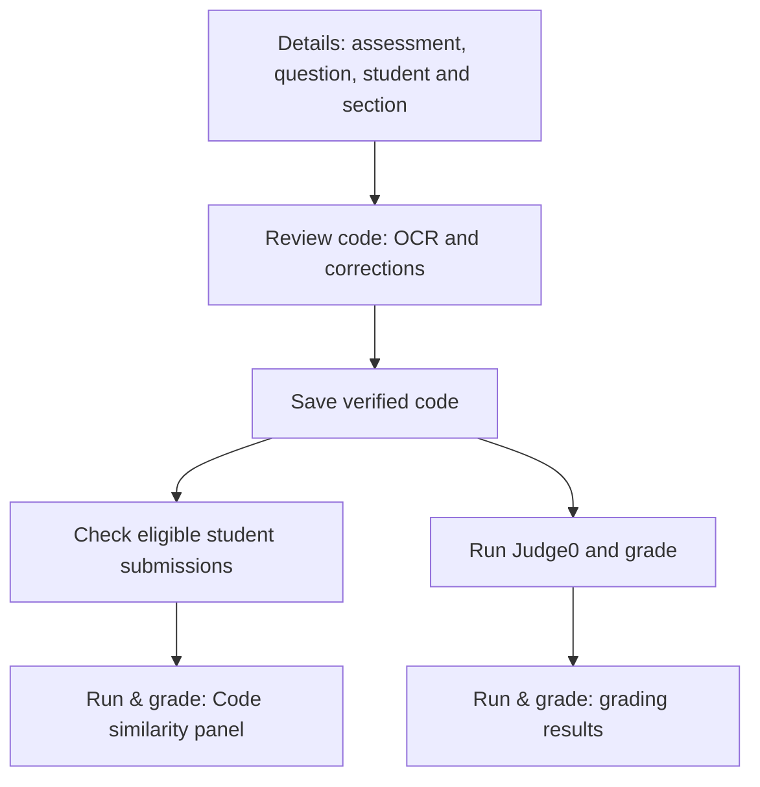

# Student code similarity: brainstorming design

Date: 2026-09-05

Status: Implemented on the `code-similarity/duplicate` branch. Production
deployment still requires authenticated similarity routes and assessment-level
authorization.

The implementation follows the scope and placement agreed below. It uses
algorithm version `c-tree-sitter-winnowing-v2`, persists reproducible scan and
pair evidence, and renders optional review inside Run & grade.

## Agreed product decisions

- Detect duplicate and similar student code.
- Compare answers to the same question in the same assessment, including
  different block sections taking that assessment.
- Teachers can reuse a saved question in future assessments. Consequently,
  the comparison group is `(assessment_id, question_id)`.
- Show findings inside the existing **Run & grade** step. Reviewing matches
  is optional; a separate mandatory review step is unnecessary.
- Implement the detector locally using the existing Tree-sitter C parser,
  Winnowing fingerprints, and token-sequence matching. Keep JPlag as a
  fallback if evaluation shows that the local detector is inadequate.

An assessment ID identifies a particular offering of an exam or activity.
Its participating block sections share that ID. A future offering receives
a new assessment ID even when it uses the same saved questions.

| Assessment | Question | Block | Group |
| --- | --- | --- | --- |
| Quiz 1 | Q101 | A | Quiz 1 / Q101 |
| Quiz 1 | Q101 | B | Quiz 1 / Q101 |
| Midterm | Q101 | A | Midterm / Q101 |

## Existing project and integration points

The repository currently has the following relevant behavior:

- `SubmissionsListComponent` owns Details, Review code, and Run & grade.
- `saveVerifiedText()` persists teacher-verified text separately from OCR output.
- `submissions.question_id` links an answer to its question.
- The mobile capture screen currently uploads an image, question ID, and status.
  It does not send assessment, student identity, or block-section IDs.
- `judge0_api/logic_checker.py` uses Tree-sitter C to compare model-answer
  features with student-code features. Its grading score is not a measure
  of similarity between students.

Assessment, stable student identity, and section relationships are missing
from the repository schema and submission flow inspected for this design.
This is a repository finding, not verification of a deployed database.

## Implemented web workflow

Details establishes the comparison group and identifies the student. The
question selector should list questions assigned to the selected assessment.
Mobile uploads should eventually carry these links; teachers can assign
missing metadata to existing submissions in Details. Missing metadata must
produce a specific incomplete state, never a scan across all submissions.

After a successful verified-code save, request a similarity check using the
persisted code. Opening Run & grade alone must not imply that code was saved:
the current editor can also contain unsaved changes. Check the student's
own code before any temporary Judge0 harness is added.

Display the panel within `SubmissionsListComponent`. Show matching students
and their sections, match type, coverage for each answer, and an expandable
comparison with highlighted passages. Preserve access to the original
handwriting when the teacher wants to verify a passage against the image.

Implemented states: missing metadata, not checked, checking, no other eligible
submissions, complete, partial analysis, outdated, and unavailable with Retry.
Only a complete, current scan can report no significant matches. Show how
many submissions were compared and skipped so early results are understandable.

Grading and Finish review remain available during checks and on failures.
Similarity findings do not automatically change marks or label a student
as having cheated. Matching code needs human interpretation, as explained in
[Stanford's Moss guidance](https://theory.stanford.edu/~aiken/moss/).

## Detection approaches considered

| Approach | Benefit | Limitation |
| --- | --- | --- |
| Exact comparison only | Small, deterministic implementation | Misses edited copies and does not cover the requested near matches |
| Local exact and token-sequence comparison | Fits the Python service and supports explanations tied to source passages | Requires implementation and evaluation on representative C answers |
| Dedicated engine such as JPlag | Provides local pairwise analysis and base-code support | Adds another runtime and integration; C support needs evaluation for this project |

The implemented first version is the local detector. It is covered by labeled
fixtures and service/database integration tests. The existing Tree-sitter dependency
supplies parsing and source positions; it is not itself a plagiarism detector. See the
[Python binding documentation](https://tree-sitter.github.io/py-tree-sitter/).
[JPlag's official documentation](https://github.com/jplag/JPlag) describes its
local operation and supported languages; it currently lists its C frontend
as legacy. Keep it as an alternative if the local prototype is inadequate.

Proposed comparison layers:

1. **Identical verified text:** compare the complete saved code after
   normalizing line endings only. Hashes may find candidate duplicates;
   confirm equality against the actual text.
2. **Same code except formatting/comments:** compare C tokens while retaining
   identifier and literal values. Removing comments must not modify strings
   or merge adjacent tokens.
3. **Similar code:** match substantial contiguous token sequences with a
   Winnowing fingerprint pass for candidate detection, followed by a
   deterministic token-sequence matching procedure that avoids counting
   tokens twice and supplies source ranges for highlighting.
   Canonicalize locally declared variable and parameter names consistently
   with their references and scopes. Preserve operators, literal values,
   and external API names. Report this as similarity, not exact duplication.

Keep original source spans for every comparable token. Never overwrite
verified text during normalization. Exclude explicitly identified supplied
starter code; the model answer is not automatically starter code. Generated
test harnesses never enter the checker. Common C syntax and matching program
output alone do not establish a meaningful match.

For each pair, report matched-token coverage separately for A and B, the
number of matched tokens, and highlighted passages. These are measurements
of code overlap, not probabilities of copying. Short or template-dominated
answers require an insufficient-evidence indication for similarity flags.
Literal exact equality can still be reported with that context.

The evaluated constants are five-token k-grams, four-hash Winnowing windows,
a 12-token minimum passage, an eight-token minimum for aligned starter
passages, and a 60% maximum-side coverage review threshold. These values were
checked against exact, renamed, starter-only, short, parser-error, and
independent examples. They are review heuristics, not a detection-accuracy promise.
Compilation is not required. Parser failures must remain visible; exact
text checks can still run, but incomplete token analysis cannot count as a
successful negative result.

## Proposed data relationships

Keep reusable questions separate from their use in a specific assessment:

- `assessments`: one exam/activity offering, with an ID and display name.
- `assessment_questions`: allowed `(assessment_id, question_id)` pairs.
  Preserve an assessment-specific question revision or snapshot of the
  prompt, starter code, model answer, and tests when assigned. Editing a
  reusable question later must not silently alter an earlier assessment.
- An assessment-to-section relationship records participating blocks.
- A stable student record and section membership identify the author.
  Display names are not unique identifiers.
- `submissions`: retain `question_id` and add assessment, student, and section
  links plus a version for the verified code. Enforce membership of the
  assessment/question pair and validate student/section assignment.
- Scan records: group, algorithm/configuration version, cohort revision,
  counts, status, timestamp, and submission versions/hashes examined.
- Pair results: scan ID, two distinct submission IDs in canonical order,
  match type, token counts, coverage values, and matching source ranges.

An `(assessment_id, question_id)` index supports group selection. Foreign
keys and uniqueness constraints should enforce valid relationships and one
pair result per scan. Result access follows permission to review the
assessment, including the allowed participating sections; knowing IDs alone
must not grant access to another assessment's code.

For repeat uploads, the proposed default is one designated current verified
answer per student per assessment/question. An explicit replacement supersedes
the earlier answer after verification; retain earlier uploads as history.
Exclude same-student comparisons. Do not infer identity from the student's
name or choose a replacement solely from a client timestamp. Resolve this
through the submission/roster workflow before enabling scans.

## Backend, refresh, and error handling

Add a separate similarity module and API route to the existing Python service.
Reuse the parser dependency while leaving `compare_logic()` and the grading
formula independent. The backend loads eligible persisted submissions and
enforces comparison scope rather than accepting an unrestricted list of
student code from the browser.

For the first version, a nonblocking UI request can run the scoped backend
scan with a bounded execution time. Persist scan state and results. An
interrupted request or restarted service must be retryable and cannot leave
a permanent Checking state. Do not promise durable background execution
without an actual job mechanism.

Version scan inputs. A code edit makes the displayed result outdated until
the edit is saved and checked. New verified answers, replacements, question
or assessment reassignment, relevant question revisions, and checker setting
changes invalidate affected groups. Results must update for both members of
a pair, including previously graded submissions. Reject stale completions
if input versions or cohort membership changed while the scan was running.

On opening the panel, load its persisted state and compare revisions; retry
or refresh stale checks. Extend the existing insert-only realtime handling
for the relevant updates, or refresh on panel entry. A failure to refresh
must preserve the outdated/unavailable state.

Student counts vary across blocks. Fetch one comparison group, prepare each
code version once, avoid duplicate unordered pairs, and reuse unaffected
cached comparisons. Measure representative workloads before setting limits.
If groups exceed the bounded request design, add durable jobs without
changing the comparison group or teacher workflow. Any partial processing
must disclose its coverage instead of reporting the entire assessment clear.

## Validation required before shipping

- Same assessment and question across blocks are included; other assessments
  or questions are excluded, including a reused question in a later exam.
- Missing identity/group metadata, self-comparison, same-student repeats,
  and superseded answers are handled explicitly.
- Exact duplicates, formatting/comment changes, consistent variable renaming,
  partial copying, different literals, and unrelated valid answers have
  explainable outcomes and accurate source highlights.
- Starter-only similarities, short exercises, common C scaffolding, and
  identical stdout do not yield unsupported copying claims.
- Unsaved edits and failed saves do not enter comparison; generated harnesses
  and raw OCR text are excluded from verified-code analysis.
- Parser failures, no candidates, timeouts, retries, page reopening, and
  service restarts have distinct and accurate states.
- Concurrent saves, late completions, new peers, replacements, and group
  reassignment cannot expose current-looking results for obsolete inputs.
- Optional match review and checker failures leave grading and Finish review
  usable, and existing OCR preservation and save guards remain intact.
- Database constraints and assessment access controls prevent invalid or
  unauthorized comparisons. Assess runtime on realistic multi-block groups.

## Suggested implementation order

1. Establish assessment/question assignment, student identity, and section
   metadata through Details and the upload flow, including legacy records.
2. Prototype and evaluate the detector on representative C answers; choose
   its thresholds and record limitations.
3. Add scoped scan persistence and version-based refresh behavior.
4. Add the Code similarity panel and highlighted comparison inside Run & grade.
5. Verify scope isolation, detection evidence, failure handling, and grading
   integration before rollout.

The confirmed decisions at the top are settled. The proposed detector,
replacement policy, question-version strategy, and operational defaults are
recorded for review before implementation.
